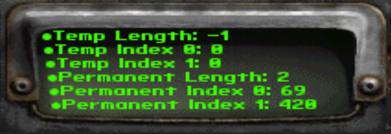

# `SignalNamed` & temp arrays

Demonstration of sfall bug: cannot use temp arrays in procs triggered via signals.

> Tested with sfall 4.3.5 and 4.3.6

```pascal
procedure use_temp_arrays begin
    variable arr = temp_array(2, 0);
    arr[0] = 69;
    arr[1] = 420;
    display_msg(sprintf("Temp Length: %s", len_array(arr)));
    display_msg(sprintf("Temp Index 0: %s", arr[0]));
    display_msg(sprintf("Temp Index 1: %s", arr[1]));
end

procedure use_permanent_arrays begin
    variable arr = create_array(2, 0);
    arr[0] = 69;
    arr[1] = 420;
    display_msg(sprintf("Permanent Length: %s", len_array(arr)));
    display_msg(sprintf("Permanent Index 0: %s", arr[0]));
    display_msg(sprintf("Permanent Index 1: %s", arr[1]));
end

procedure start begin
    if game_loaded then begin
        AddNamedHandler("PermanentArrayTest", use_permanent_arrays);
        AddNamedHandler("TempArrayTest", use_temp_arrays);
        SignalNamed("PermanentArrayTest");
        SignalNamed("TempArrayTest");
    end
end
```


